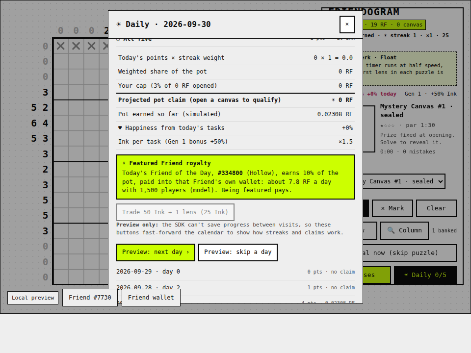

# Friendogram

Picross (nonogram) puzzles drawn from **your own Rare Friend's 16 × 16 on-chain sprite**. Solve the grid and your Friend walks off the board.

Rare Friends Vibeathon entry · FriendSDK **v0.1.2** · Builder: Pavan Raj R.

**Play:** https://pavanraj08-boop.github.io/friendogram/ (needs a browser wallet on Robinhood mainnet, chain 4663, holding a hardwired Generations NFT, generation 1 or higher; all RF is simulated)


## What's in it

- **Portrait puzzles** from your Friend's own poses (front, profiles, back, mid-stride).
- **Never a guess:** a built-in solver guarantees every puzzle can be finished by logic alone, adding locked anchor cells only where needed. Puzzles are rated ★–★★★★ with a par time.
- **Family perks:** your Friend's real family changes the rules; the rare 2.5% families get the strongest perks.
- **Lenses:** reveal a row or column. After free ones, each costs 0.1 RF and **100% is burned**.
- **☀ Friend of the Day:** the same mystery Rare Friend for every player each day, with a shareable result card.
- **Mystery Canvas (1 RF):** a chance-backed relic (6 tiers, 0.90 RF expected value) you reveal by solving it, then keep or sell.
- **Stamps and a celebration:** ◆ Perfect, ∴ Pure logic, » Swift; your Friend walks across the solve card.
- **☀ Daily tasks, streaks and the Daily Pot:** five daily tasks pay Ink and points. Points × streak weight (up to ×3 at 30 days) share a pot funded by the canvas edge (60% pot / 20% burn / 20% developer). Claims are capped below the edge, so no play pattern returns 100% or more; missing a day halves the streak. Daily players earn 2.2× the bonus per RF of casual players. Analysis: [game/economy/README.md](game/economy/README.md).
- **Session economy ledger** in the Gallery: canvas spend, edge split, lens burn, relic sales, pot claims and total RF removed from supply.



## Repository layout

- `game/`: game source (`index.tsx`, `nonogram.ts`, `relics.ts`, `perks.ts`, `daily.ts`, `rewards.ts`, `game.json`, `style.css`, `host.css`), rules README, tests, and `economy/` (simulation + results)
- `docs/`: the built static preview served by GitHub Pages (output of `npx friendsdk build`)

## Run locally

```sh
git clone https://github.com/spokesz/friendsdk.git && cd friendsdk
git checkout v0.1.2
mkdir -p games && cp -r ../friendogram/game games/friendogram
npm ci
npm run dev:game -- games/friendogram
```

Open `http://localhost:4173`, connect your wallet and select your Friend.

Checks: `npx friendsdk check games/friendogram`, `node games/friendogram/solver.test.mjs`, `node games/friendogram/rewards.test.mjs`, and the browser tests `browser.test.mjs 960`, `deep.test.mjs`, `features.test.mjs`, `iterate.test.mjs`, `daily.test.mjs` (need `npm i -D playwright && npx playwright install chromium`). Economy model: `python3 games/friendogram/economy/simulate.py`.

Full rules, odds and economy terms: [game/README.md](game/README.md).
