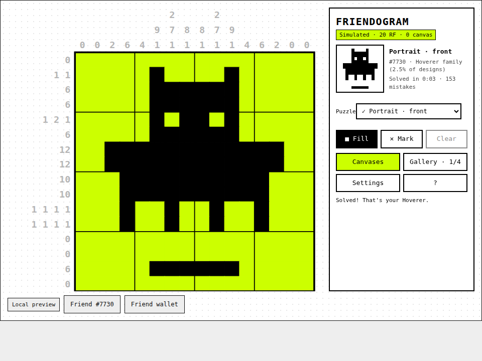

# Friendogram

Picross (nonogram) puzzles drawn from **your own Rare Friend's 16 × 16 on-chain sprite**. Solve the grid and your Friend walks off the board. A simulated 1 RF **Mystery Canvas** rolls a relic that you reveal by solving it.

Rare Friends Vibeathon entry · FriendSDK **v0.1.2** · Builder: Pavan Raj R.

**Play:** https://pavanraj08-boop.github.io/friendogram/ (needs a browser wallet on Robinhood mainnet, chain 4663, holding a hardwired Generations NFT, generation 1 or higher; all RF is simulated)



## Repository layout

- `game/`: game source (`index.tsx`, `nonogram.ts`, `relics.ts`, `game.json`, `style.css`, `host.css`), rules README and browser tests
- `docs/`: the built static preview served by GitHub Pages (output of `npx friendsdk build`)

## Run locally

```sh
git clone https://github.com/spokesz/friendsdk.git && cd friendsdk
git checkout v0.1.2
mkdir -p games && cp -r ../friendogram/game games/friendogram
npm ci
npm run dev:game -- games/friendogram
```

Open `http://localhost:4173`, connect your wallet and select your Friend.

Checks: `npx friendsdk check games/friendogram`, `npx friendsdk test games/friendogram`, `node games/friendogram/browser.test.mjs 960`, `node games/friendogram/deep.test.mjs` (needs `npm i -D playwright && npx playwright install chromium`).

Full rules, odds and economy terms: [game/README.md](game/README.md).
